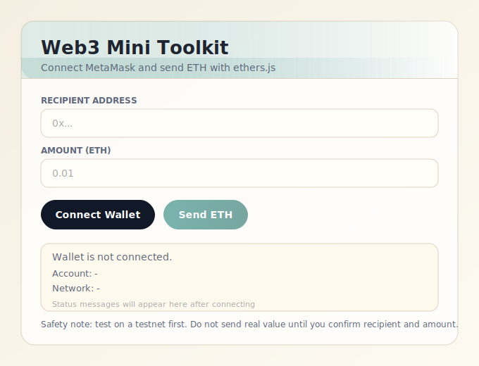

# Web3 Mini Toolkit

A minimal single-page dApp that lets users connect their MetaMask wallet and send ETH in three clicks — no framework, no build step, no backend.

---

## UI Preview



---

## User Story

> **As a crypto user,**
> I want to open a webpage, connect my MetaMask wallet, enter a recipient address and ETH amount, and send a transaction —
> **so that** I can transfer ETH without installing any app or setting up a development environment.

### Acceptance Criteria

| # | Given | When | Then |
|---|-------|------|------|
| 1 | User opens the page with MetaMask installed | Clicks **Connect Wallet** | MetaMask pops up and requests account access |
| 2 | Wallet is connected | Page loads account info | Account address and active network are shown |
| 3 | User enters a valid recipient and amount | Clicks **Send ETH** | MetaMask opens the transaction confirmation dialog |
| 4 | User confirms the transaction in MetaMask | Transaction is mined | Tx hash appears with a block explorer link |
| 5 | User rejects the transaction in MetaMask | Rejection is caught | A clear error message is shown, no crash |
| 6 | User enters an invalid address or zero amount | Clicks **Send ETH** | Validation error is shown before MetaMask is invoked |
| 7 | Connected chain is Ethereum mainnet | Wallet connects | A prominent safety warning is displayed |
| 8 | User switches wallet account or network | MetaMask fires the change event | UI resets or reloads to reflect new state |

---

## Features

- **One-click wallet connect** — uses `eth_requestAccounts` via `window.ethereum`
- **Live network detection** — identifies Mainnet, Sepolia, Polygon, Optimism, Arbitrum, and custom chains
- **Mainnet safety warning** — highlights risk when sending on Ethereum mainnet
- **Recipient + amount inputs** — user-controlled; no hardcoded addresses
- **Client-side validation** — checks `ethers.isAddress()` and positive numeric amount before sending
- **Transaction lifecycle** — tracks pending → confirmed with block number
- **Block explorer links** — auto-generates Etherscan/Polygonscan/etc links for confirmed txs
- **Wallet event handling** — responds to `accountsChanged` and `chainChanged` events from MetaMask
- **Zero dependencies** — ethers.js loaded via CDN; no npm install required
- **Single file** — everything in `index.html`; open it directly in any browser

---

## Stack

| Tool | Purpose |
|------|---------|
| [MetaMask](https://metamask.io) | Wallet provider (`window.ethereum`) |
| [ethers.js v6](https://docs.ethers.org/v6/) | `BrowserProvider`, `getSigner`, `sendTransaction` |
| Vanilla HTML/CSS/JS | UI, styling, and event logic |

---

## Usage

```bash
# No install needed — just open the file
open index.html
```

Or serve it locally:

```bash
npx serve .
# then open http://localhost:3000
```

### Happy Path

1. Open `index.html` in a browser with MetaMask installed
2. Click **Connect Wallet** — approve in MetaMask
3. Enter a recipient `0x...` address and ETH amount
4. Click **Send ETH** — confirm in MetaMask
5. Tx hash with block explorer link appears on success

---

## Safety

- Always test on **Sepolia testnet** before sending real value
- The app warns explicitly when connected to Ethereum Mainnet
- No private keys, secrets, or sensitive data ever touch this codebase
- Validate recipient address independently before confirming large transactions

---

## Development Workflow

This repo follows a standard branch → PR → merge flow:

```
main                    ← production-ready default branch
feature/<name>          ← short-lived feature branches
```

```bash
git checkout -b feature/my-change
# make changes
git add .
git commit -m "feat: describe the change"
git push -u origin feature/my-change
# open PR → review → merge → delete branch
```

---

## License

MIT
